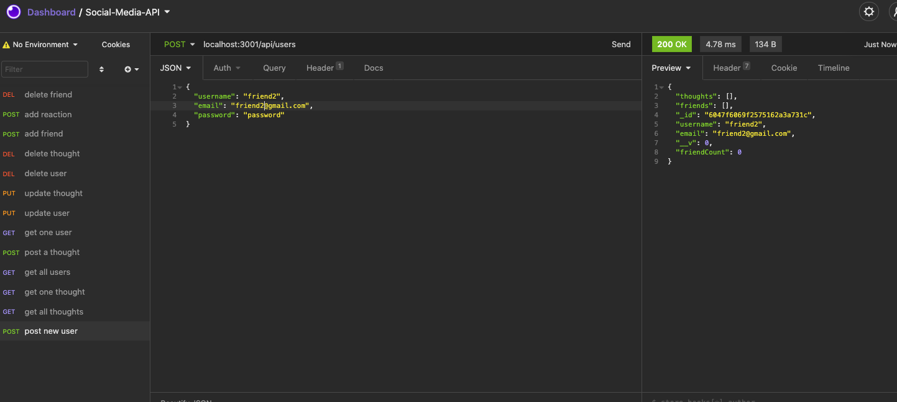
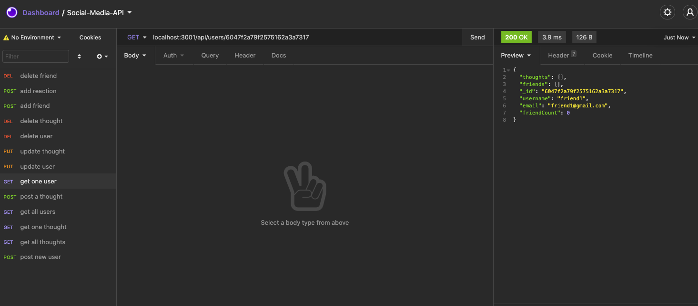
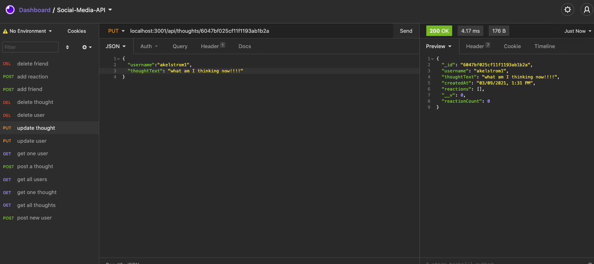
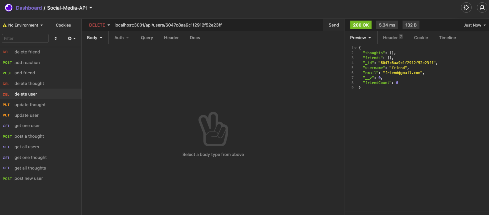
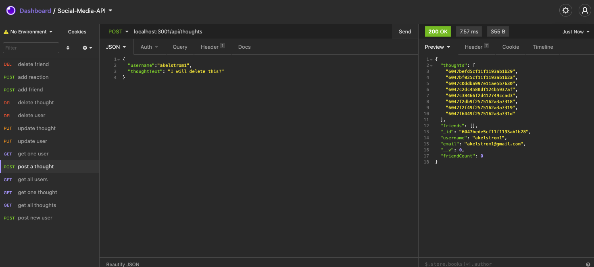
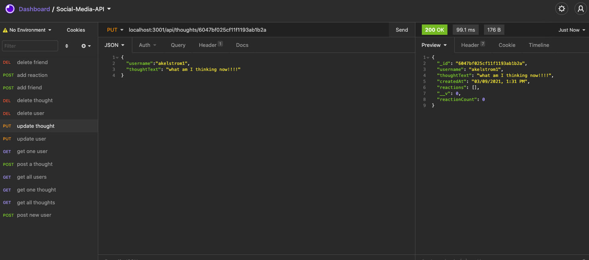
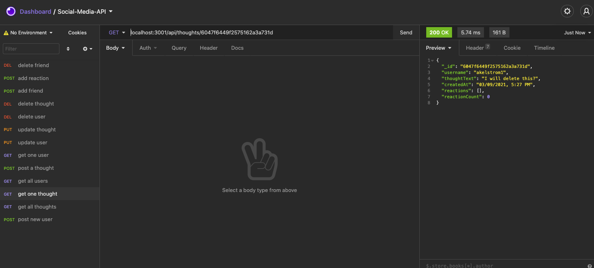
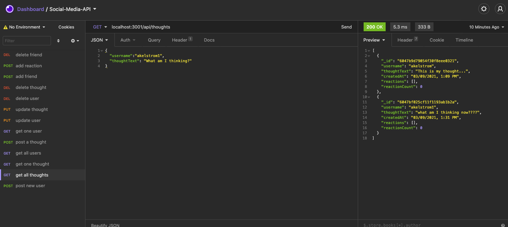
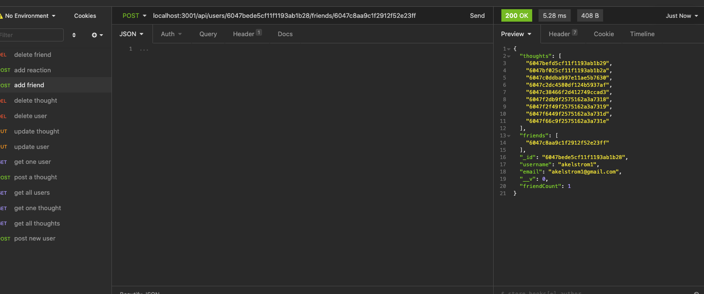
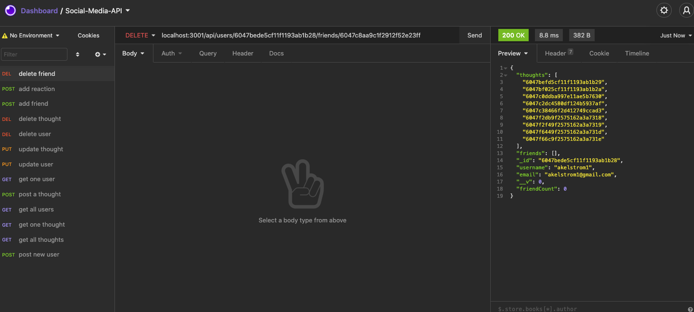

# Social Media API 

## Description
An API for a social network web application where users can share their thoughts, react to friends’ thoughts, and create a friend list. I used Express.js for routing, a MongoDB database, and the Mongoose ODM.

## User Story
AS A social media startup
I WANT an API for my social network that uses a NoSQL database
SO THAT my website can handle large amounts of unstructured data

## Installation
Make sure to have `node` installed. 

## Usage
Open up the project in VSCode, navigate to the root folder in terminal and use command `npm start` to start the server. Then open up Insomnia Core to implement tests using the proper routes.

### User Routes

### Thought Routes

### Friend Routes

## Built With
* JavaScript
* NoSql
* Node.js
* Express.js
* MongoDB
* Mongoose ODM
* Date-FNS

## Credits
Big thanks to the instructional team at Upenn LPS Coding Bootcamp for their support: TA's, Andy Durette, Symone Varnado, Chris Hackett, Nate Sopko, my instructor, Chase Clettenberg, and my tutor, Jon Jackson. 

## Questions
If you have any questions, please don't hesitate to reach out by email: akelstrom@gmail.com.
